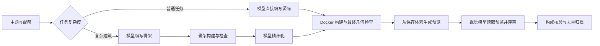

# Voxlush Gen

> ……先把一栋做好。然后，再做下一栋。

Voxlush Gen 用模型独立设计 Minecraft 风格的建筑、自然景观和复合场景，再将它们构建为体素、渲染、检查、归档，整理成可追溯的训练数据。

你设置目标、模型、预算和数据位置。后端负责持续补任务、有限返修、质量检查和保存结果。面板用来看进度、看作品，也用来暂停和调整活动；关掉浏览器，后端仍然工作。

每个资产都有自己的几何源码。模型可以使用底层体素 API、循环、函数和数学几何，自由决定结构与细节。项目不靠固定房型换颜色补数量。

[安装](#安装) · [第一次启动](#第一次启动) · [接入模型](#接入模型与-api-池) · [生成活动](#建立生成活动) · [构成模式](#构成模式与配额) · [持续运行](#暂停重启与持续运行) · [数据导出](#查看与导出数据) · [常见情况](#常见情况)

## 项目怎样工作



正常普通任务接近 **1 次作者生成 + 1 次视觉评审**；复杂建筑接近 **骨架 + 精细化 + 视觉评审**。只有具体错误才进入有限返修。Docker、文件系统和评审格式问题各自处理，不让作者为了环境故障重新画一栋建筑。

项目采用 Python 后端、SQLite、本地文件归档和 React 面板。一份数据目录只允许一个调度进程。模型编写的代码在 Docker 中隔离执行，预览来自实际保存的体素。

### 目前验证到哪里

截至 **2026-10-09**：

| 项目 | 已有证据 |
| --- | --- |
| 软件可靠性 | 完整 Python 测试 322 项通过，1 项可选私有样例跳过；已有前端构建、浏览器及真实本地构建/渲染测试记录 |
| 断流后的连续派发 | 本地真实 TCP 断连、重启和连续多次未知结果测试通过；原请求记录保留，新任务能够继续 |
| 最近一轮构成模式实测 | 16 个独立任务，归档 2 个候选，正式样本 0；其中普通建筑 8 个任务归档 2 个，复杂两阶段建筑 8 个任务归档 0 个 |
| 长期规模运行 | 尚未完成 100～200 个任务的统一配置验证和持续运行验收；不能用离线测试代替真实产出率 |

可以在明确预算内运行候选生产。正式大规模训练数据仍要按质量合同校准模型，并观察真实的通过率和成本。软件能持续调度，与模型能稳定产出好建筑，是需要分别确认的两件事。

最新状态见 [STATUS](docs/STATUS.md)，完整证据见 [验收报告](reports/acceptance_report.md)。

## 安装

下面按 **Linux / Bash** 编写。已测试环境使用 Python 3.12；项目声明支持 Python 3.12～3.13。前端需要 Node.js 20.19+，构建和渲染需要可用的 Docker。

默认有 1 个构建 worker、1 个渲染 worker，`local_memory_mb` 为 4096。这个字段用于本地资源配置，不代表整台机器只需要 4 GiB；还要为系统、后端和容器留余量。数据目录使用本地磁盘，空间消耗取决于体素规模、原始响应、预览和保留的修订数。

```bash
git clone https://github.com/BorderRegion/Voxlush_Gen.git
cd Voxlush_Gen

python3.12 -m venv .venv
source .venv/bin/activate
python -m pip install -e '.[dev]'

npm --prefix frontend ci
npm --prefix frontend run build

python sandbox/build_image.py
```

最后一步生成 `voxlush-sandbox:v2`（保留旧 v1 镜像用于旧版本回滚）。构建时需要访问基础镜像和 Python 依赖；运行生成代码的沙箱关闭网络。执行服务的用户需要能正常访问 Docker。不要在宿主机上直接运行模型返回的 Python 源码。

## 第一次启动

先开一个不会调用模型的面板。确认本地环境能工作，再接模型。

### 1. 生成自己的配置

在仓库根目录运行：

```bash
python - <<'PY'
import json
from pathlib import Path

config = json.loads(Path("configs/campaign.example.json").read_text())
config["data_root"] = str(Path.home() / ".local/share/voxlush")
config["frontend_dist"] = str(Path("frontend/dist").resolve())
path = Path.home() / ".config/voxlush/config.json"
path.parent.mkdir(parents=True, exist_ok=True, mode=0o700)
with path.open("x") as handle:
    handle.write(json.dumps(config, ensure_ascii=False, indent=2) + "\n")
path.chmod(0o600)
print(path)
PY

export VOXLUSH_CONFIG="$HOME/.config/voxlush/config.json"
```

配置已存在时，这段代码会停止，避免覆盖已有设置。之后直接使用原文件即可。

示例保持 `allow_live: false`、`global_api_cap: 0`，且没有模型端点。此时不会产生模型请求。`data_root` 存数据库和资产，`frontend_dist` 指向已构建的面板；建议两者都使用绝对路径。

### 2. 检查并启动

```bash
voxlush --config "$VOXLUSH_CONFIG" doctor
voxlush --config "$VOXLUSH_CONFIG" serve
```

`doctor` 检查本地执行与渲染环境，不调用收费模型。退出码为 0 表示本地检查通过；失败时先看输出中的原因。

打开 **<http://127.0.0.1:8740/>**。当前终端承载后端，按 `Ctrl-C` 正常关闭。新终端使用命令前，需要重新激活虚拟环境并设置配置路径：

```bash
source .venv/bin/activate
export VOXLUSH_CONFIG="$HOME/.config/voxlush/config.json"
```

## 接入模型与 API 池

需要两个角色：

| 角色 | 要求 |
| --- | --- |
| `author` | 能返回完整几何源码，用于初次生成、骨架、精细化和必要返修 |
| `visual` | 真正支持图像输入，读取体素预览，评价建筑与场景质量 |

可以连接同一个池，也可以使用不同服务。接口采用 OpenAI 兼容的 Chat Completions 格式；程序会在 `base_url` 后追加 `/chat/completions`，不要把完整请求路径填进去。

### 端点配置

先停止本地服务，在配置文件中替换以下同名字段，保留之前的 `data_root` 和 `frontend_dist`。地址和模型 ID 都是占位符，需要换成你自己的值。

```json
{
  "allow_live": false,
  "global_api_cap": 2,
  "unknown_execution_policy": "continue_new_tasks",
  "unknown_backoff_seconds": 30,
  "author": {
    "alias": "author",
    "base_url": "https://your-pool.example/v1",
    "model": "YOUR_AUTHOR_MODEL_ID",
    "api_key_env": "VOXLUSH_API_KEY",
    "stream": true,
    "completion": "finish_and_done",
    "provider_cap": 2,
    "pool_receipts": false,
    "parameters": {
      "max_tokens": 262144,
      "temperature": 1.0,
      "top_p": 0.95
    },
    "first_content_timeout": 600,
    "idle_timeout": 240,
    "total_timeout": 2300
  },
  "visual": {
    "alias": "visual",
    "base_url": "https://your-pool.example/v1",
    "model": "YOUR_VISION_MODEL_ID",
    "api_key_env": "VOXLUSH_API_KEY",
    "supports_images": true,
    "stream": true,
    "completion": "finish_and_done",
    "provider_cap": 2,
    "pool_receipts": false,
    "parameters": {
      "max_tokens": 8192
    },
    "first_content_timeout": 600,
    "idle_timeout": 240,
    "total_timeout": 2300
  }
}
```

这是**字段用法示例**。其中 token 和超时取自早期 DeepSeek/GLM 试验的设置，不是所有模型的通用推荐值，也不代表该组合已经取得质量资格。请保留自己已经验证过的模型参数；不要直接把不支持的参数交给另一个模型。

`parameters` 会原样转发。思考开关或 `reasoning_effort` 应按具体服务填写，例如支持该字段的 GLM 端点可以在其中设置 `"reasoning_effort": "max"`。不要为了缩短响应时间，未经比较就关闭已验证的思考设置。也不要只因一次失败，就无限增加 token 和超时。

`supports_images: true` 是对能力的声明，不会让纯文本模型获得看图能力。需要用真实图片确认端点确实支持图像。

### 密钥与流协议

在启动后端的终端中输入密钥，输入时不会回显：

```bash
read -r -s -p 'API key: ' VOXLUSH_API_KEY
export VOXLUSH_API_KEY
printf '\n'
```

两个角色使用不同密钥时，分别配置不同的 `api_key_env`。程序读取环境变量，不会自动加载 `.env`；长期运行时可由服务管理器提供环境文件。

| 配置项 | 含义 |
| --- | --- |
| `completion: "finish_and_done"` | SSE 需要正常结束原因与 `[DONE]`；默认使用此契约 |
| `completion: "finish"` | 用于确认只提供语义结束标记的端点，不应拿来掩盖断流 |
| `stream: false` + `completion: "nonstream"` | 使用非流式响应，两项一起设置 |
| `first_content_timeout` | 等待首个有效正文或思考片段的时间，心跳不算内容 |
| `idle_timeout` | 两次有效进展之间允许的最长间隔 |
| `total_timeout` | 本次本地请求总时限，不是上游执行终止保证 |
| `pool_receipts` | 仅在池实现本项目的持久回执协议时开启；普通兼容接口保持 `false` |

有语义结束标记，也不代表源码完整。长度截断、空正文、格式不合法仍不能作为成功结果继续入库。仅有 `[DONE]`、HTTP 200、连接关闭或回执 404，都不足以证明上游已经停止执行。

池回执协议、部署和恢复说明见 [ops/pool-receipts](ops/pool-receipts/README.md)。

### 怎样才会开始调用模型

配置检查完成后，将 `allow_live` 改为 `true`，重新启动服务：

```bash
voxlush --config "$VOXLUSH_CONFIG" doctor
voxlush --config "$VOXLUSH_CONFIG" serve
```

新安装还需要创建并启动活动，才会生成任务。已有 `running` 活动则可能在服务恢复后自动继续，因此修改配置前应按需要暂停或排空活动。

实际派发同时受到全局上限、活动上限、端点容量、限速、预算和本地队列约束。任一相关上限为 0，都不会派发。自适应调度可能进一步降低并发。

同一服务上的作者与视觉角色默认共享容量。二者的 `provider_cap`、`rpm`、`tpm` 必须一致。只有确实独立的容量才设置不同的 `capacity_pool`，不要用不同名字制造额外额度。

## 建立生成活动

“活动”是一组持续补齐的生成目标。创建不等于启动；下面命令需要后端已经运行。

先做 20 个纯建筑候选，最多使用 160 次模型请求，并发上限为 2：

```bash
voxlush --config "$VOXLUSH_CONFIG" campaign create buildings "纯建筑校准" 20 \
  --request-limit 160 --api-cap 2 \
  --scene-weights '{"architecture":1}' \
  --composition-weights '{"pure_target":1}'

voxlush --config "$VOXLUSH_CONFIG" campaign start buildings
```

这里的 20 是有效产出目标；160 是整个活动的请求上限，包含初次生成、精细化、返修和视觉评审。它们不是同一个计数。请求预算可能先耗尽，不能保证 160 次一定得到 20 个候选。

新配置尚未取得模型质量资格时，合格结果记为候选 `provisional_pass`。满足候选数量及构成配额后，活动可以以 `calibration_target_reached` 完成；正式 `accepted_unique` 仍为 0。取得资格后的生产活动才按正式样本补齐。

不指定场景权重时，默认是建筑 60%、自然 25%、复合场景 15%。只做自然景观可以使用 `--scene-weights '{"natural":1}'`，自然任务不会套用建筑的纯主体比例或室内要求。

### 请求、金额和本地资源

| 设置 | 位置 | 作用 |
| --- | --- | --- |
| `request_limit` | 活动；CLI 为 `--request-limit` | 活动累计模型请求上限，重启不清零 |
| `sample_request_limit` | 顶层配置，默认 8 | 单个样本所有阶段的请求上限 |
| `geometry_repairs` / `visual_repairs` | 顶层配置，默认 2 / 1 | 几何和视觉返修次数上限，仍受请求总上限限制 |
| `review_format_retries` / `transport_retries` | 顶层配置，默认各 1 | 有限格式/传输重试；不会因此重发结果未知的原请求 |
| `cost_limit` | 创建活动的 API 请求 | 活动金额预算；当前 CLI 和创建表单未提供这个输入项 |
| `cost_upper_bound` | 每个端点 | 单次请求的可用费用上界；金额预算需要用它预留 |
| `input_per_million` / `output_per_million` | 每个端点 | 按实际价格与统一货币单位配置，用于成本核算 |
| `rpm` / `tpm` / `reservation_tokens` | 每个端点 | 每分钟请求、预留 token 限额及每次预留量 |
| `build_workers` / `render_workers` | 顶层配置 | 本地并行构建与渲染数，与模型并发分别配置 |
| `initial_api_cap` | 顶层配置，默认 8 | 启动时的本地请求并发；实际仍受全局、活动和端点上限约束；遇到限流或积压会降低，响应恢复稳定后逐步回升到这个上限 |
| `receipt_recovery_endpoints` | 顶层配置，默认空列表 | 换模型线路时保留旧端点，用于查询旧请求回执；不会向这些端点发送新生成请求 |
| `disk_reserve_bytes` | 顶层配置，默认 1 GiB | 剩余空间低于此值时停止新的付费派发 |

需要金额预算时，先为两个端点填写可信的费用上界和价格，再通过 API 创建活动。例如下方 `cost_limit: 10` 使用与你填写的单价相同的货币单位；它是示范预算，按实际需要修改。

```bash
python - <<'PY'
import os
import httpx

headers = {}
if os.getenv("VOXLUSH_ADMIN_TOKEN"):
    headers["Authorization"] = "Bearer " + os.environ["VOXLUSH_ADMIN_TOKEN"]
response = httpx.post("http://127.0.0.1:8740/api/v1/campaigns", headers=headers, json={
    "campaign_id": "budgeted_buildings",
    "name": "有金额预算的纯建筑",
    "target": 20,
    "request_limit": 160,
    "api_cap": 2,
    "cost_limit": 10,
    "scene_weights": {"architecture": 1},
    "composition_weights": {"pure_target": 1}
})
response.raise_for_status()
print(response.json())
PY
```

这只创建活动，尚未启动。金额预算存在但缺少费用上界时，系统会阻止派发。只有请求预算时，次数受控，实际花费仍取决于模型价格。计费不明会保留为未知，不能把面板中的已知费用当成最终账单；界面的 `$` 也不执行汇率换算。

## 构成模式与配额

环境可以少一点。建筑本身的细节，不必跟着少。

| `composition_mode` | 生成要求 | 建筑数据集默认权重 |
| --- | --- | ---: |
| `pure_target` | 聚焦建筑本身；保留必要地基和合理附属结构，尽量不带额外场景 | 40% |
| `light_context` | 建筑明显主导，允许短路径、少量植物、小围栏等轻量上下文 | 30% |
| `contextual` | 建筑与适量庭院、地形、路径等共同组成场景，建筑仍是主要焦点之一 | 20% |
| `environment_rich` | 允许丰富环境叙事和建筑—自然组合，同时保持主体边界与用途清楚 | 10% |

普通建筑和复杂两阶段建筑都支持这些模式。`pure_target` 不要求简化成盒子，也不等于删掉屋顶、窗框、台阶、承重结构或有用的细节。

系统同时看实际占用体素、组件归属、主体投影和真实预览。纯建筑的初始几何限制为非主体体素不超过 10%、主体占用 XZ 列比例至少 80%；轻上下文为 25% 和 60%。这是可解释的约束，不能代替视觉质量判断。

**请求类别与观察结果分别保存。** 环境丰富模式即使允许少量环境，一栋实际为纯建筑的结果也不能填充它的有效配额；实际环境过量的样本，也不能仅凭请求写着 `contextual` 就进入标准上下文训练集。边界不确定的结果保留诊断，不能靠改标签补数。

创建混合建筑活动：

```bash
voxlush --config "$VOXLUSH_CONFIG" campaign create mixed_buildings "建筑构成校准" 100 \
  --request-limit 800 --api-cap 2 \
  --scene-weights '{"architecture":1}' \
  --composition-weights '{"pure_target":40,"light_context":30,"contextual":20,"environment_rich":10}'
```

权重按比例归一化，不必加起来恰好为 100。系统根据有效归档的缺口继续补齐；失败、重复或构成不符的任务不抵扣配额。某类难做，也不能用另一类多出来的样本替代。有限重试、预算和持续零产出保护仍然生效。

活动创建后，构成权重固定。需要另一种分布时创建新活动。自然场景的模式为 `null`；复合场景只使用 `contextual` 与 `environment_rich`，按默认权重归一化后为 2:1。包含复合场景却把这两项都设为 0，会被拒绝。

40/30/20/10 是目前的起始建议，还没有足够的同配置真实样本证明它是最优比例。只训练单体建筑时，可以直接用 100% `pure_target`。

## 暂停重启与持续运行

### 日常控制

服务运行时，通过面板或另一终端操作：

```bash
voxlush --config "$VOXLUSH_CONFIG" campaign pause buildings
voxlush --config "$VOXLUSH_CONFIG" campaign resume buildings
voxlush --config "$VOXLUSH_CONFIG" campaign set_cap buildings --api-cap 1
voxlush --config "$VOXLUSH_CONFIG" campaign drain buildings
```

上面是命令清单，按需要选一条执行。

| 操作 | 行为 |
| --- | --- |
| `pause` | 停止该活动的新阶段派发，已在途工作可以收尾；重启后仍暂停 |
| `resume` | 恢复活动，继续已有预算、记录与任务 |
| `drain` | 停止新的模型请求，让已返回结果继续完成本地构建、渲染、归档；尚需模型评审的任务会等待 |
| `set_cap` | 调整活动模型并发，不得超过全局授权上限；设为 0 可临时停止新请求 |
| `emergency_stop` | 紧急停止派发并取消本地在途模型请求；不能承诺已经取消上游执行 |

正常关闭服务会保留原本的运行意图。用同一数据目录重新启动后，先恢复状态和已有响应，再继续原来应当运行的活动。用户主动 `pause`、`drain` 或 `emergency_stop` 的活动不会被重启擅自恢复。

计划重启且希望尽量不打断请求时，可以先将活动 cap 设为 0，等待在途任务收尾，再关闭并重启，最后恢复 cap。**cap 0 会持久保留，需要自己恢复。** 如果用了 `drain`，重启后还需要 `resume`。

### 某条请求断流了，其他任务还会继续吗

愿意接受少量中断样本留待处理时，使用顶层配置：

```json
{
  "unknown_execution_policy": "continue_new_tasks",
  "unknown_backoff_seconds": 30
}
```

这个模式下，某条请求结果未知，会先保留原始记录并搁置该样本。池经过退避后，可以继续派发其他任务。原请求不会自动重发；若池后来提供可验证的完整响应，系统可以继续处理那份原响应。

旧请求的未知执行、费用和预算预留都还在。放开的是**本地新请求的派发**，并不是宣布上游已经结束。因此本地 cap 只限制本地活动请求，无法证明远端仍在执行的总数量。服务端限额、限速和 `Retry-After` 仍须遵守。

仓库示例已选用这个模式。旧配置如果没有该字段，仍默认使用 `isolate_pool`：有未知执行时隔离对应池，等待有效终止证据。切换模式需要修改配置并重启后端；它不会清空账目，也不会自动重新启用网关中被禁用的账户。

只有确切的完成/取消证据，才使用执行对账操作。健康页恢复、等待了一段时间或收到 404，都不能代替证据。详见 [运行与恢复说明](docs/OPERATIONS.md#unknown-execution-reconciliation)。

### 哪些故障能自行恢复

| 情况 | 处理方式 |
| --- | --- |
| 单个样本源码或几何错误 | 在额度内返修；耗尽后结束该样本，其他任务继续 |
| Docker 或渲染器短暂不可用 | 暂停相关生产，做低成本本地探测；恢复后继续执行原源码，不发模型请求探测环境 |
| 完整响应已保存，但写样本文件失败 | 重用保存的响应做有限本地恢复，不重新调用原模型；耗尽后保留明确诊断 |
| 临时限速或服务繁忙 | 有限退避，遵守服务端等待时间；连续生产模式的池退避会跨重启保留 |
| 断流、结果未知 | 按上面的策略隔离旧样本并继续新任务，或隔离对应池 |
| 磁盘满、只读文件系统、数据库写入失效 | 停止新的付费派发，等待修复存储问题 |
| 认证失败、配额用尽、预算耗尽、持续零产出 | 给出原因并限制或停止生产，需要处理对应问题 |

连续运行不是永远发送请求。上游整体不可用时没有结果可生成；长期没有有效产出时，也需要停下来查原因。

长期挂在服务器上可使用 [systemd 模板](docs/OPERATIONS.md#systemd-template)。固定代码版本、环境文件和数据路径，保持一个调度进程。关闭浏览器不会停后端；直接关闭承载前台服务的终端则可能停止进程。

使用 `PrivateTmp=true` 时，要按模板设置宿主机可见的 `TMPDIR`，并预先创建该目录。否则服务里的临时源码对 Docker 守护进程不可见，会出现「bind source path does not exist」。部署检查也要在相同的服务环境中执行。

## 查看与导出数据

### 面板里看什么

| 页面 | 用途 |
| --- | --- |
| 运行总览 | 正式/候选产出、活跃请求、未知占位、预算、队列和当前停止原因 |
| 样本作品 | 查看真实预览、源码与工件、请求和失败记录；按构成模式筛选 |
| 覆盖与质量 | 查看主题与构成缺口、有效归档、通过情况、失败原因和平均请求数 |
| 活动与设置 | 创建活动、控制并发、提交导出；检查连接配置格式 |

页面上的配置校验只验证格式，不保存服务器配置，也不调用模型。密钥和端点仍在服务器环境与配置文件中管理。

### 候选与正式样本

| 状态 | 含义 |
| --- | --- |
| `provisional_pass` | 样本已通过当前自动检查并归档，但模型配置尚未取得正式质量资格 |
| `accepted_unique` | 使用已取得资格的配置生产、通过质量检查且去重有效的正式样本计数 |
| `legacy_complete_unverified` | 历史导入记录，未按当前合同重新验收 |

正式资格绑定模型参数、提示、质量检查和视觉标准等版本。当前合同要求至少 100 个真实人工审查记录、至少 96% 通过率，以及与配置匹配的资格证据文件。改一个 `qualified` 布尔值，不能代替校准。人工没打的分，就留空。

### 在线导出与命令行导出

**服务运行时，优先在面板提交导出。** 后端会生成固定快照并提供发布文件。

下面的 CLI 导出、盲评画廊、备份和实际历史导入会打开 Store，因此需要先排空、等待在途任务收尾并停止后端，避免第二个进程争用数据目录。尚未派发的模型阶段可以留在库中等待恢复。发布与备份路径使用新的、位于仓库外的目录。

先导出候选以便检查：

```bash
voxlush --config "$VOXLUSH_CONFIG" export \
  --campaign buildings \
  --output "$HOME/voxlush-releases/buildings-candidates-v1" \
  --include-provisional

voxlush verify-release "$HOME/voxlush-releases/buildings-candidates-v1"
```

**默认不带 `--include-provisional` 时，只导出正式样本。** 初次校准尚无正式样本时，默认导出为空是正常的。包含候选的发布仍保留 `accepted`、`record_kind` 和 `split`，不会把候选伪装为正式训练集。

仅导出纯建筑与轻上下文候选：

```bash
voxlush --config "$VOXLUSH_CONFIG" export \
  --campaign mixed_buildings \
  --output "$HOME/voxlush-releases/pure-light-candidates-v1" \
  --include-provisional \
  --composition-mode pure_target \
  --composition-mode light_context
```

按固定比例导出 100 个候选：

```bash
voxlush --config "$VOXLUSH_CONFIG" export \
  --campaign mixed_buildings \
  --output "$HOME/voxlush-releases/mixed-candidates-v1" \
  --include-provisional \
  --composition-weights '{"pure_target":40,"light_context":30,"contextual":20,"environment_rich":10}' \
  --composition-count 100
```

任一模式数量不足，混合导出会明确失败，不拿其他模式替代。筛选同时要求请求类别与实际构成证据合格；未指定筛选，也不会放行已有明确构成不符的样本。

同一个发布目录是固定快照。再次执行相同导出会校验并返回已有发布，不会追加新资产；需要包含新结果时换一个输出目录。恢复旧策略的中间导出遇到冲突时，也应保留旧目录并使用新路径。

### 导出文件

| 文件 | 内容 |
| --- | --- |
| `source_sft.jsonl` | 任务指令、约束与完整作者源码，包含构成模式和数据划分 |
| `asset_index.jsonl` | 资产索引、来源、标签、hash、构成证据和分片内路径 |
| `repair_pairs.jsonl` | 有真实前后错误与检查证据的修复对；没有有效修复对时可以为空 |
| `shard-*.tar` | 资产工件分片 |
| `shard_index.json` | 分片索引、大小和校验信息 |
| `dataset_card.json` | 数据集计数、划分方法与已知限制 |
| `release_manifest.json` | 发布快照、模式分布和文件完整性记录 |

正式数据按 lineage、重复关系、源码、几何与任务关系分组后划分 train/val/test，目标比例为 90/5/5。候选与 fixture 保留在 calibration/excluded 分区，使用时不要直接混入正式划分。

### 每个归档资产留下什么

主要工件包括 `brief.json`、`authored_source.py`、`build.py`、`sample.json.gz`、`voxels.npz`、`palette.json`、`components.json`、`geometry.json`、`review.json`、两张实际预览和 `manifest.json`；适用时还保存运行时资源、去重证据、配置快照与修复对。

新构建和新归档只保存 gzip 压缩的逐体素 JSON，不再同时留下明文副本。压缩不改变体素、材料、组件、坐标或几何 hash；读取、渲染、归档校验、盲评和训练导出同时兼容旧 `sample.json` 与新 `sample.json.gz`。已有归档与发布不会自动改写。训练读取分片时，请使用 `asset_index.jsonl` 的 `paths.sample`，不要写死扩展名。也可以直接读取更紧凑的 `voxels.npz` 与 `palette.json`。

```python
import gzip
import json
from pathlib import Path

asset = Path("/path/to/asset")
if (asset / "sample.json.gz").is_file():
    with gzip.open(asset / "sample.json.gz", "rt", encoding="utf-8") as handle:
        sample = json.load(handle)
else:
    sample = json.loads((asset / "sample.json").read_text(encoding="utf-8"))
```

图像只在最终几何通过、需要视觉审核时生成两张真实视角，作为审核证据保存；不再生成额外的 `contact.webp` 拼接图。面板列表不批量加载预览，打开某个样本详情后才读取已有审核图。查看图片不会调用模型或重新执行作者源码。骨架和未通过几何的样本不会为了面板出图。必要的视觉质量关卡仍然保留。

旧工作目录通常比最终归档更占空间，可以在排空、停止服务并完成备份后，进行一次无损压缩：

```bash
voxlush --config "$VOXLUSH_CONFIG" compact-work          # 先查看可压缩数量
voxlush --config "$VOXLUSH_CONFIG" compact-work --apply  # 执行并输出逐文件校验记录
```

此命令独占同一个 Store，并拒绝活动仍在运行、存在执行中请求或样本租约的情况。它只处理 `work/` 下未发布的明文副本：先写入并回读压缩文件，确认与原文件逐字节一致，才移除明文。已登记下载的路径、正式归档、发布、源码、思考内容、请求和费用账目不动；出错时保留原文件。中断后可以再次执行。旧版程序不支持仅 gzip 的工作目录和新归档，因此回滚旧程序应使用升级前的完整备份，不能只切回旧 Git 提交。

manifest 分开记录请求标签 `requested_tags`、模型声明 `generator_declared`、观察标签 `observed_tags`，以及构成要求、实测特征和是否达标。源码、体素与预览有对应校验信息。原始响应、请求账目和版本记录也保存在数据目录中。

体素使用 `256³` 整数坐标域，Y 向上，north=-Z、south=+Z、east=+X、west=-X。训练时应读取资产记录的版本、材料和坐标合同。

### 随机盲评画廊

在服务停止后，为人工校准生成一个新的画廊目录：

```bash
voxlush --config "$VOXLUSH_CONFIG" blind-gallery \
  --campaign mixed_buildings \
  --output "$HOME/voxlush-reviews/mixed-v1" \
  --count 100 --seed 42
```

把 `reviewer/` 交给评审，`curator/` 留给组织者。评分文件 `reviewer/scores.json` 初始为空。画廊使用已有真实预览，不产生新模型请求；样本不足不能当成完成了 100 个样本的质量校准。

## 备份与恢复

先 `drain`，等待已经在运行的请求与本地任务收尾，然后停止服务。使用新目录备份：

```bash
voxlush --config "$VOXLUSH_CONFIG" backup \
  --output "$HOME/voxlush-backups/before-update-v1"

voxlush restore \
  --source "$HOME/voxlush-backups/before-update-v1" \
  --destination "$HOME/.local/share/voxlush-restored-v1"
```

备份包含一致的数据库快照与相关工件，恢复时校验内容。目标目录必须尚不存在，避免覆盖原始数据。配置文件和 API 密钥环境需要另外保管。

恢复后，将配置的 `data_root` 指向新目录，再检查和启动。原活动状态、请求预算和未知记录都会保留；之前主动排空的活动需要显式 `resume`。不要让原目录和恢复目录同时运行同一批活动。

更新代码前先备份，部署固定版本，按需要重建前端和沙箱，再运行 `doctor`。数据库旧版本会在打开时迁移；回退到不能读取新结构的旧程序时，应使用升级前备份恢复到新目录。不要用无人值守的 `git pull` 直接替换正在运行的版本。

历史资产导入先预览：

```bash
voxlush --config "$VOXLUSH_CONFIG" import-legacy \
  --source /path/to/legacy-data --dry-run
```

确认来源与路径后，停止服务，再移除 `--dry-run` 执行实际导入。历史 complete 不会自动获得当前的正式资格。

## 常见情况

| 看到的情况 | 先检查什么 |
| --- | --- |
| 面板没有页面或提示 `frontend build unavailable` | 是否执行前端构建，`frontend_dist` 是否指向实际的绝对路径 |
| 创建活动后没有请求 | 是否 `start`；`allow_live`、全局/活动/端点 cap 是否允许派发；总览的停止原因是什么 |
| 重启后仍不生成 | 用户的 pause/drain、cap 0、预算与未知策略会保留；根据原因处理，不必重建活动 |
| `awaiting_visual` | 是否配置了实际可读图的视觉模型；仅有作者模型无法完成最终视觉验收 |
| 有候选，但正式数量为 0 | 模型配置尚未取得资格；检查候选计数，查看时使用包含候选的导出 |
| 已知费用很低，却有未知费用 | 上游没有提供完整用量或可核算价格；已知费用不是总账单 |
| 未知计数一直在增长 | 查看中断记录和端点状态；连续生产模式保留这些记录，不会为了显示空闲而清零 |
| `cost_budget_exhausted` | 实际预算不足，或启用了金额预算却没有端点费用上界；未知预留也占预算 |
| `disk_low_watermark` / `storage_unavailable` | 先处理空间、权限或数据库问题；不要手动删除运行中的状态库 |
| Docker 恢复了，某个样本仍被阻塞 | 查看是否已耗尽有限本地恢复次数或版本不匹配；修复原因后再对该样本重试 |
| 提示数据目录已有 owner | 后端仍在运行，或另一个 CLI 正在占用 Store；先结束对应操作，不要强行删锁并启动第二个 owner |
| 导出为空或混合比例不足 | 正式/候选选项、当前实际类别合规和每类可用数量是否匹配 |

局部工件问题修好后，可以对允许重试的样本提交：

```bash
voxlush --config "$VOXLUSH_CONFIG" campaign retry buildings --sample-id SAMPLE_ID
```

结果未知的原请求不能靠这个命令重发。重试也不会清空该样本的历史费用与修复额度。

### 远程使用

单人使用可让后端继续监听 `127.0.0.1`，通过 SSH 转发访问：

```bash
ssh -L 8740:127.0.0.1:8740 user@generation-host
```

如需远程公开监听，配置 `VOXLUSH_ADMIN_TOKEN` 并使用受保护的 TLS 反向代理。面板通过管理员 token 登录；远程 CLI 通过 `VOXLUSH_API_URL` 指向受保护地址。管理员 token 和模型 API key 是两个用途不同的凭据。

## 开发与验证

后端验证：

```bash
source .venv/bin/activate
python -m pytest -q backend/tests --tb=short
python -m ruff check backend/src backend/tests
```

前端构建与浏览器验证：

```bash
npm --prefix frontend run build
cd frontend
npx playwright install chromium
npm run test:e2e
npm run test:real
cd ..
```

浏览器环境还需安装对应的系统依赖。`test:e2e` 使用模拟传输；`test:real` 启动实际本地后端、Docker 和渲染流程，但模型回答与视觉判定仍为 fixture。上述测试不调用收费模型，也不能用于证明模型审美质量。

开发面板可以使用 `npm --prefix frontend run dev`，默认代理到 `127.0.0.1:8740`；后端另行启动。生产使用构建后的静态文件。

## 目录与资料

```text
backend/src/voxlush/
  api/          HTTP 接口与面板服务
  core/         配置和公共数据处理
  store/        SQLite、预算、状态与迁移
  inference/    模型请求、流解析与回执恢复
  pipeline/     调度、提示和生成阶段
  voxel/        体素、几何检查、沙箱与渲染
  themes/       主题规划与构成配额
  dataset/      归档、去重、导出、盲评与备份
backend/tests/  后端回归测试
frontend/       面板与浏览器测试
sandbox/        隔离镜像构建
configs/        无密钥示例配置
ops/            API 池回执协议及部署资料
docs/           运行说明与项目状态
reports/        验收及试验摘要
```

运行数据在你配置的 `data_root` 下，包括 `runtime.db`、`runs/`、`assets/` 等。配置、密钥、原始响应、日志、数据集和备份均不应随源码提交。

| 文档 | 用途 |
| --- | --- |
| [docs/STATUS.md](docs/STATUS.md) | 当前实现、部署状态和未完成的验证 |
| [docs/OPERATIONS.md](docs/OPERATIONS.md) | 对账、迁移、恢复、systemd 与细节操作 |
| [reports/acceptance_report.md](reports/acceptance_report.md) | 各轮测试与真实生成验收证据 |
| [reports/unknown_continuation_validation.json](reports/unknown_continuation_validation.json) | 断流后继续生产的回归与池配置证据 |
| [reports/live_composition_validation.json](reports/live_composition_validation.json) | 最近构成模式实测的分组产出、token 与失败记录 |
| [docs/DECISIONS.md](docs/DECISIONS.md) | 关键实现选择及理由 |
| [docs/WORKLOG.md](docs/WORKLOG.md) | 简短变更记录 |

## 许可证

仓库保留 [MIT License](LICENSE)。复用资源及其来源见 [THIRD_PARTY_NOTICES.md](THIRD_PARTY_NOTICES.md)；其中部分资源的分发授权仍需向原权利人确认，不能据仓库许可证推定全部资源也采用 MIT。

生成数据、输入资料和模型服务各自的使用权，以对应来源与每个资产的许可记录为准。

> 能确定的，好好留下来。还不能确定的，也如实记着。
